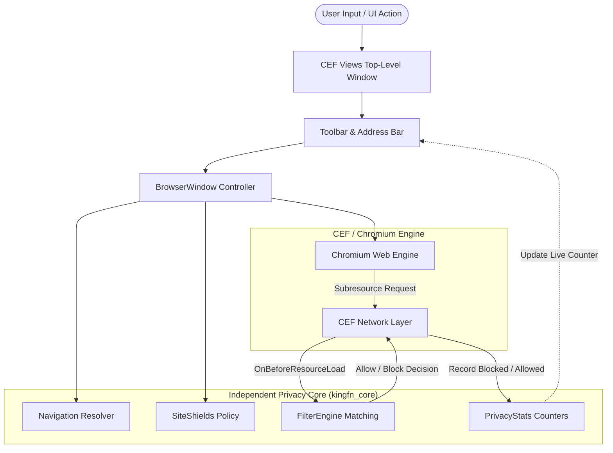
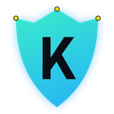

<div align="center">


# 👑 KINGFN BROWSER
### *The Sovereign Windows Browser • High-Speed Chromium Engine • Built-in Privacy Shields*

[](https://github.com/Farhan0629/Bravelike/actions/workflows/core-ci.yml)
[](https://en.cppreference.com/w/cpp/20)
[](https://microsoft.com/windows)
[](https://bitbucket.org/chromiumembedded/cef)
[](config/sample-blocklist.txt)
[](LICENSE)

[**Features**](#-features) • [**Quick Start**](#-quick-start) • [**Architecture**](#-architecture) • [**Shields Engine**](#-kingfn-shields-engine) • [**Shortcuts**](#-keyboard-shortcuts) • [**Build Guide**](#-building-from-source) • [**Roadmap**](#-roadmap)

</div>

---

## 📖 Overview

**KINGFN Browser** is an original, privacy-first desktop web browser built from scratch in modern **C++20** on the **Chromium Embedded Framework (CEF)** with native Windows Views.

Unlike conventional browsers loaded with tracking telemetry, background services, and corporate surveillance, **KINGFN** delivers a sovereign browsing environment:
- 👑 **Sovereign Privacy**: Zero cloud telemetry, zero sync profiling, and isolated local storage (`KINGFNProfile`).
- 🛡️ **KINGFN Shields Engine**: Native C++ filter pipeline that intercepts and drops tracker, ad, and telemetry requests at the network layer before they execute.
- ⚡ **True Native Windows Performance**: Direct C++20 implementation utilizing native Win32/CEF Views—no Electron, no web-view wrappers, and minimal resource footprint.
- 🎨 **Royal Dark-Mode Experience**: Custom local start page with glowing cyan/mint accents, DuckDuckGo privacy search, and quick access portals.

---

## ⚡ Status at a Glance

| Component | Status | Details |
| :--- | :--- | :--- |
| **Privacy Core** | ✅ **Active** | Standalone C++20 engine (`kingfn_core`) with unit tests |
| **Windows Shell** | ✅ **Active** | CEF Views top-level window with toolbar and navigation controls |
| **Network Interception** | ✅ **Active** | Pre-resource request evaluation with `RV_CANCEL` blocking |
| **Per-Site Shields** | ✅ **Active** | In-memory site-specific toggle with live blocked request metrics |
| **Local Home Portal** | ✅ **Active** | Custom native `resources/home.html` start page |
| **CI Automation** | ✅ **Active** | Dual-platform CI (Ubuntu + Windows) with artifact generation |
| **Multi-Tab Interface** | 🔄 *Planned* | Tab strip, tab sessions, and tab-scoped privacy contexts |
| **Bookmark & History DB** | 🔄 *Planned* | Embedded SQLite engine for private on-device history |

---

## 👑 Features

### 1. 🛡️ Native KINGFN Shields
- Intercepts all subresource requests initiated by pages.
- Evaluates targets against domain blocklists and allow rules in real time.
- Displays an interactive **Shields: On (count)** toggle on the toolbar.
- Allows toggling Shields per-site without affecting other domains.
- Automatically disables on internal or non-HTTP pages (`Shields: N/A`).

### 2. ⚡ Sovereign Start Page (`kingfn://home`)
- Beautiful, high-performance local start page (`resources/home.html`).
- Built-in multi-search selector (DuckDuckGo default, Google, Bing).
- Fast quick-launch tiles (GitHub, YouTube, Wikipedia, Reddit, ChatGPT, DuckDuckGo).
- Displays live shortcut helpers and browser status.

### 3. 🔍 Smart Address & Navigation Bar
- Smart resolution: automatically distinguishes hostnames, explicit URLs, and search terms.
- Typing `example.com` automatically navigates to `https://example.com`.
- Typing plain text generates an encoded DuckDuckGo privacy search query.
- Aliases supported: enter `home`, `kingfn`, or `about:home` to instantly return to your home portal.
- Synchronized title bar: page titles seamlessly format as `<Page Title> - KINGFN`.

### 4. 🛡️ Intel GPU Crash Prevention
- Automated fallback switch prevents GPU driver virtualization crashes on modern Intel Iris Xe and integrated GPUs.
- Ensures solid startup and rock-stable rendering on all Windows hardware.

---

## 🏛️ Architecture

KINGFN strictly decouples the privacy core from the Chromium Embedded Framework. This guarantees that all privacy, URL analysis, and filtering logic remain cleanly testable, auditable, and embeddable without external dependencies.



### Module Responsibilities

| Directory / Module | Responsibilities |
| :--- | :--- |
| [`src/core/filter_engine.*`](file:///c:/Users/FARHAN/OneDrive/Desktop/Kaggle/Bravelike/src/core/filter_engine.h) | Parses filter rule files, normalizes domains, evaluates URLs, prioritizes allow rules |
| [`src/core/navigation.*`](file:///c:/Users/FARHAN/OneDrive/Desktop/Kaggle/Bravelike/src/core/navigation.h) | Handles URL detection, scheme normalization, and search query URL encoding |
| [`src/core/site_shields.*`](file:///c:/Users/FARHAN/OneDrive/Desktop/Kaggle/Bravelike/src/core/site_shields.h) | Thread-safe per-host Shields activation and disabled-domain set |
| [`src/core/privacy_stats.*`](file:///c:/Users/FARHAN/OneDrive/Desktop/Kaggle/Bravelike/src/core/privacy_stats.h) | Atomic thread-safe tracking of evaluated and blocked request metrics |
| [`src/core/url_utils.*`](file:///c:/Users/FARHAN/OneDrive/Desktop/Kaggle/Bravelike/src/core/url_utils.h) | ASCII case normalization, HTTP authority parsing, subdomain hierarchy checking |
| [`src/browser/main_win.cpp`](file:///c:/Users/FARHAN/OneDrive/Desktop/Kaggle/Bravelike/src/browser/main_win.cpp) | Win32 entry point, profile configuration (`KINGFNProfile`), CEF initialization |
| [`src/browser/browser_window.*`](file:///c:/Users/FARHAN/OneDrive/Desktop/Kaggle/Bravelike/src/browser/browser_window.h) | CEF client implementation, toolbar controls, keyboard handlers, Shields UI |
| [`src/browser/browser_app.*`](file:///c:/Users/FARHAN/OneDrive/Desktop/Kaggle/Bravelike/src/browser/browser_app.h) | CEF application lifecycle and command-line switch management |
| [`resources/home.html`](file:///c:/Users/FARHAN/OneDrive/Desktop/Kaggle/Bravelike/resources/home.html) | Local native dark-mode royal dashboard with DuckDuckGo search integration |

---

## 🚀 Quick Start

### Running Pre-Built KINGFN Browser

1. Clone or download this repository:
   ```cmd
   git clone https://github.com/Farhan0629/Bravelike.git
   cd Bravelike
   ```
2. Launch the browser using the root launcher:
   ```cmd
   run-kingfn.bat
   ```
   *(Or run `.\out\ci-release\kingfn_browser.exe` directly)*.

The browser will open instantly to the KINGFN start page:

<div align="center">
  
</div>

---

## ⌨️ Keyboard Shortcuts

KINGFN provides lightning-fast keyboard productivity navigation:

| Key Combination | Action | Description |
| :--- | :--- | :--- |
| <kbd>Ctrl</kbd> + <kbd>L</kbd> | **Focus Address Bar** | Highlights and selects address input ready for typing |
| <kbd>Ctrl</kbd> + <kbd>R</kbd> | **Reload Page** | Refreshes the currently active web page |
| <kbd>Alt</kbd> + <kbd>←</kbd> | **Go Back** | Navigates to the preceding page in history |
| <kbd>Alt</kbd> + <kbd>→</kbd> | **Go Forward** | Navigates forward in history |
| <kbd>Alt</kbd> + <kbd>Home</kbd> | **Return Home** | Instantly navigates to the local KINGFN start page |
| <kbd>Escape</kbd> | **Stop Loading** | Cancels the active page loading process |
| <kbd>Enter</kbd> | **Execute Search / URL** | Navigates address bar input |

---

## 🛡️ KINGFN Shields Engine

The Shields Engine supports standard domain-matching syntax designed for high evaluation speed:

```text
# Comments and blank lines are ignored
ads.example.com              # Blocks ads.example.com and its subdomains
||tracker.example^           # Standard Adblock-style domain anchor
@@allowed.tracker.example    # Exception rule: allows this domain even if blocked
```

### Rule Evaluation Semantics

1. **Allow rules have absolute precedence**: If a domain matches an allow rule (`@@`), it is immediately permitted regardless of block rules.
2. **Subdomain matching**: Blocking `example.com` automatically blocks `cdn.example.com`, `ads.example.com`, and any nested subdomains.
3. **No accidental suffix collisions**: Blocking `example.com` will **not** block `badexample.com`.
4. **Unsupported rules fall back safely**: If an unsupported syntax is encountered, it logs a non-fatal warning and defaults to allowing rather than breaking legitimate user traffic.

---

## 🛠️ Building from Source

### Prerequisites

- **Operating System**: Windows 11 or Windows 10 (64-bit)
- **Compiler**: Visual Studio 2022 (Community or higher) with **Desktop development with C++**
  - MSVC v143 toolset
  - Windows 10/11 SDK
- **Build System**: CMake **3.24** or later
- **Version Control**: Git for Windows

Verify your environment using our diagnostic script:
```powershell
.\scripts\check-windows-prerequisites.ps1
```

---

### Step 1: Build & Run Privacy Core Tests

The core privacy library and test suite have **zero external dependencies** and compile in seconds:

```powershell
# Configure and build
cmake -S . -B out\build -G "Visual Studio 17 2022" -A x64 -DKINGFN_BUILD_TESTS=ON
cmake --build out\build --config Release

# Execute test suite
ctest --test-dir out\build -C Release --output-on-failure
```

Run the interactive CLI filter testing tool:
```powershell
.\out\build\Release\kingfn_filter_demo.exe config\sample-blocklist.txt
```

---

### Step 2: Build the Full CEF Desktop Browser

The build system automatically downloads and verifies the official pinned Windows 64-bit CEF distribution (`152.0.7` / Chromium `152.0.7977.83`):

```powershell
# Configure with CEF enabled
cmake -S . -B out\cef `
  -G "Visual Studio 17 2022" -A x64 `
  -DKINGFN_ENABLE_CEF=ON `
  -DUSE_SANDBOX=OFF

# Compile the browser target
cmake --build out\cef --config Release --target kingfn_browser
```

Launch your newly compiled build:
```powershell
.\out\cef\Release\kingfn_browser.exe
```

---

## 🗺️ Roadmap

- [x] **Milestone 1**: Standalone C++20 privacy core with comprehensive unit tests.
- [x] **Milestone 2**: Native CEF Views Windows single-window shell with synchronized address bar.
- [x] **Milestone 3**: Network request interception with Shields blocking and stats counters.
- [x] **Milestone 4**: Custom KINGFN royal brand identity, crown icon, and local start portal.
- [x] **Milestone 5**: Hardware crash resilience and GPU virtualization protection.
- [ ] **Milestone 6**: Native tabbed browsing interface and tab bar controller.
- [ ] **Milestone 7**: Embedded SQLite history and bookmarks database with search.
- [ ] **Milestone 8**: File download manager with progress indicators and virus scan hook.
- [ ] **Milestone 9**: Persisted per-domain Shields preferences in local database.
- [ ] **Milestone 10**: Installer packaging (NSIS / MSIX) and auto-update mechanism.

---

## ⚖️ Legal & Trademarks

- **KINGFN Browser** is an independent, custom open-source browser project.
- Chromium and Google Chrome are trademarks of Google LLC.
- Brave is a trademark of Brave Software, Inc.
- All product and service names used herein are for identification purposes only and belong to their respective owners.

<div align="center">
  <sub>👑 KINGFN Browser • Built with precision and sovereignty. Crafted for Windows.</sub>
</div>