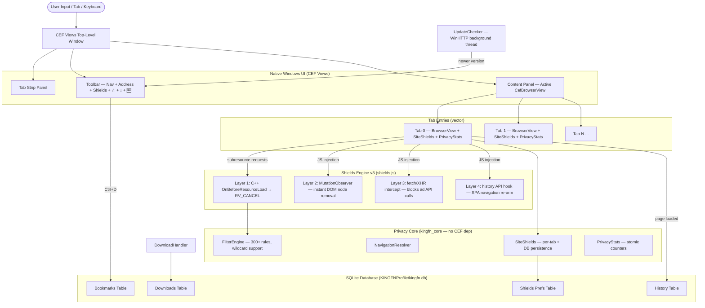

<div align="center">


# 👑 KINGFN BROWSER
### *The Sovereign Windows Browser — High-Speed Chromium Engine — Complete Privacy Suite*

[](https://github.com/Farhan0629/Bravelike/actions/workflows/core-ci.yml)
[](https://en.cppreference.com/w/cpp/20)
[](https://microsoft.com/windows)
[](https://bitbucket.org/chromiumembedded/cef)
[](config/kingfn-blocklist.txt)
[](https://github.com/Farhan0629/Bravelike/releases)
[](LICENSE)

[**Features**](#-features) • [**Quick Start**](#-quick-start) • [**Architecture**](#-architecture) • [**Shields Engine**](#-kingfn-shields-engine-v3) • [**Shortcuts**](#-keyboard-shortcuts) • [**Build Guide**](#-building-from-source) • [**Roadmap**](#-roadmap)

</div>

---

## 📖 Overview

**KINGFN Browser** is an original, privacy-first desktop web browser built from scratch in modern **C++20** on the **Chromium Embedded Framework (CEF)** with native Windows Views.

Unlike conventional browsers loaded with tracking telemetry, background services, and corporate surveillance, **KINGFN** delivers a complete, sovereign browsing experience with every feature you need for daily use — **YouTube, chess.com, general web surfing** — all without a single ad or tracker in sight.

- 👑 **Sovereign Privacy** — Zero cloud telemetry, zero sync profiling, and isolated local storage (`KINGFNProfile`)
- 🛡️ **KINGFN Shields Engine v3** — 4-layer ad elimination (network block + DOM mutation + JS intercept + SPA hook) with 300+ rules covering Google, YouTube, Twitch, Facebook, and more
- 🗂️ **Full Multi-Tab Browsing** — Native CEF tab management with per-tab shields, history, and stats
- 📚 **History & Bookmarks** — SQLite-backed, fully searchable, persists across sessions
- ⬇️ **Download Manager** — Built-in progress tracking with an internal downloads page
- 💾 **Persistent Shields Preferences** — Per-site shield state saved to SQLite, survives restarts
- 📦 **NSIS Installer** — One-click setup EXE with Start Menu + Desktop shortcuts
- 🔄 **Auto-Update Checker** — Checks GitHub Releases on startup, shows notification when update available
- ⚡ **True Native Windows Performance** — Direct C++20 + CEF Views with no Electron, no web-view wrappers

---

## ⚡ Status at a Glance

| Component | Status | Details |
| :--- | :--- | :--- |
| **Privacy Core** | ✅ **Active** | Standalone C++20 engine with wildcard rule support + unit tests |
| **Shields Engine v3** | ✅ **Active** | 4-layer defense: network + MutationObserver + fetch/XHR intercept + SPA hook |
| **Windows Shell** | ✅ **Active** | CEF Views window with toolbar and full navigation controls |
| **Multi-Tab Browsing** | ✅ **Active** | Native tab strip, Ctrl+T/W/Tab, per-tab state, popup interception |
| **History & Bookmarks** | ✅ **Active** | SQLite database, auto-recorded visits, Ctrl+D bookmark toggle |
| **Download Manager** | ✅ **Active** | CefDownloadHandler, progress tracking, internal downloads page |
| **Persistent Shields** | ✅ **Active** | Per-site shield prefs persisted to SQLite across restarts |
| **NSIS Installer** | ✅ **Active** | One-click setup EXE with shortcuts, registry, and uninstaller |
| **Auto-Update Checker** | ✅ **Active** | GitHub Releases API check on startup, toolbar notification |
| **YouTube Ad Blocking** | ✅ **Active** | Zero-flash ad elimination: DOM nuked before render via MutationObserver |
| **Twitch Ad Blocking** | ✅ **Active** | fetch/XHR intercept + DOM removal + CSS hiding |
| **chess.com Ad Blocking** | ✅ **Active** | Sidebar/board ad selectors in shields.js |
| **GPU Crash Prevention** | ✅ **Active** | SwiftShader WebGL + disable-gpu-compositing for Intel Iris Xe |
| **Fullscreen Support** | ✅ **Active** | F11 hides tab strip + toolbar; YouTube F key works correctly |
| **Error Pages** | ✅ **Active** | Branded dark-mode error page for network failures |
| **DPI Awareness** | ✅ **Active** | Per-monitor DPI awareness V2 for sharp rendering on HiDPI displays |

---

## 👑 Features

### 1. 🛡️ KINGFN Shields Engine v3 — 4-Layer Ad Elimination

The Shields engine uses four independent, mutually reinforcing layers so ads have no chance of appearing — even on complex SPAs like YouTube:

| Layer | Where | What it does |
| :--- | :--- | :--- |
| **Network block (C++)** | `OnBeforeResourceLoad` | Cancels HTTP requests matching 300+ domain/path rules before any bytes are sent |
| **MutationObserver (JS)** | `shields.js` | Watches the DOM — the instant an ad node is inserted, it is hidden *before* it renders |
| **fetch / XHR intercept (JS)** | `shields.js` | Wraps `window.fetch` and `XMLHttpRequest` to silently swallow YouTube & Twitch ad API calls |
| **History API hook (JS)** | `shields.js` | Wraps `pushState` / `replaceState` to re-arm the killer after every SPA navigation (YouTube video-to-video, etc.) |

**YouTube specifics:** When an ad is detected via the `ad-showing` class, the engine mutes the video, sets playback rate to 16×, seeks to the end, and auto-clicks skip — all within 100 ms, making ads invisible in practice.

**Twitch specifics:** Ad network domains (`jtvnw.net/ad`, `twitchadvertising.tv`, `spade.twitch.tv`) are blocked at the network layer; fetch/XHR intercept handles same-origin ad break signals; CSS hides overlay countdown timers.

### 2. 🗂️ Native Multi-Tab Browsing

- **Tab strip** above the toolbar — each tab shows its title + `×` close button
- **Ctrl+T** new tab · **Ctrl+W** close tab · **Ctrl+Tab** / **Ctrl+Shift+Tab** cycle · **Ctrl+1–9** jump
- Each tab runs its own live `CefBrowserView` — pages stay loaded in background tabs
- Each tab has **independent shields state, blocked-request counter, and URL**
- Popup links (`target="_blank"`, `window.open`) redirect into a new KINGFN tab instead of spawning a new window
- Active tab highlighted with `▶` prefix in the strip

### 3. 📚 History & Bookmarks (SQLite)

- Every page visit is **automatically recorded** (URL, title, visit count, last-visit timestamp) in `KINGFNProfile/kingfn.db`
- **Ctrl+H** opens the internal history page — a dark-mode, searchable, tabbed view of your history and bookmarks
- **Ctrl+D** or the `☆` toolbar button toggles a bookmark for the current page; button shows `★` when bookmarked
- History uses `INSERT OR REPLACE` with `ON CONFLICT` so revisiting a page increments the visit counter rather than creating a duplicate
- SQLite uses **WAL mode** for safe concurrent reads during browsing

### 4. ⬇️ Download Manager

- **All downloads** are tracked in SQLite with URL, filename, save path, progress, and status
- Files are saved to `~/Downloads` with the OS native save-file dialog
- **Ctrl+J** or the `↓` toolbar button (shows active count like `↓(2)`) opens the internal downloads page
- Downloads page shows real-time progress bars, status badges (COMPLETE / DOWNLOADING / ERROR / CANCELLED), file paths, and timestamps

### 5. 💾 Persistent Shields Preferences

- Per-site shield on/off state is **saved to SQLite** and **loaded on startup**
- Each tab independently reads its site's shield preference when navigating
- Toggling shields via the toolbar button or the `Shields: On/Off` label instantly persists the change

### 6. 📦 NSIS Installer (Milestone 10)

- Professional one-click setup EXE built with **NSIS Modern UI 2**
- Installs to `%ProgramFiles%\KINGFN Browser`
- Creates **Start Menu** folder and **Desktop** shortcut
- Registers in **Add/Remove Programs** with size estimate and publisher info
- Registers as a **default browser candidate** in the Windows registry
- Uninstaller preserves `KINGFNProfile` (your history, bookmarks, and preferences)
- Build with: `.\scripts\build-installer.ps1`

### 7. 🔄 Auto-Update Checker (Milestone 10)

- On every launch, KINGFN silently queries the **GitHub Releases API** (`api.github.com/repos/Farhan0629/Bravelike/releases/latest`) on a background thread
- If a newer version is found, a `🆕 Update` button appears in the toolbar **and** a 12-second toast notification is injected into the active page
- Clicking either navigates to the GitHub releases page for download
- Uses **WinHTTP** (built into Windows, no extra dependency) with 5 s connect / 10 s receive timeouts
- Silently ignores all network errors — never blocks startup

### 8. 🔍 Smart Address Bar + Navigation

- Distinguishes URLs, bare hostnames, and search queries automatically
- Typing `chess.com` → navigates to `https://chess.com`
- Typing plain text → DuckDuckGo privacy search (default) or Google / Bing
- **Escape** in address bar restores the current URL and returns focus to the page
- Alias keywords: `home`, `kingfn`, `kingfn://home`, `about:home` all return to the KINGFN start page

### 9. ⌨️ Full Keyboard Shortcut Suite

| Shortcut | Action |
| :--- | :--- |
| `Ctrl+T` | New tab |
| `Ctrl+W` | Close current tab |
| `Ctrl+Tab` / `Ctrl+Shift+Tab` | Next / previous tab |
| `Ctrl+1` – `Ctrl+9` | Jump to tab by number |
| `Ctrl+L` | Focus address bar |
| `Ctrl+R` / `F5` | Reload page |
| `Ctrl+Shift+R` / `Shift+F5` | Hard reload (ignore cache) |
| `Ctrl+D` | Toggle bookmark for current page |
| `Ctrl+H` | Open History & Bookmarks page |
| `Ctrl+J` | Open Downloads page |
| `Alt+←` / `Alt+Backspace` | Go back |
| `Alt+→` | Go forward |
| `Alt+Home` | Go to KINGFN home page |
| `F11` | Toggle fullscreen (hides tab strip + toolbar) |
| `Escape` | Stop loading / exit fullscreen |

---

## 🏛️ Architecture



### Module Responsibilities

| Module | Responsibilities |
| :--- | :--- |
| `src/core/filter_engine.*` | Parses filter rules (domain, path, wildcards), evaluates URLs, allow rules win unconditionally |
| `src/core/navigation.*` | URL detection, scheme normalization, search query encoding |
| `src/core/site_shields.*` | Per-tab shield toggle; loads/saves disabled hosts from SQLite on startup/toggle |
| `src/core/privacy_stats.*` | Atomic thread-safe blocked/evaluated request counters per tab |
| `src/core/database.*` | SQLite wrapper for history, bookmarks, shields prefs, and downloads |
| `src/browser/browser_window.*` | Multi-tab orchestration, tab strip, toolbar, all CEF handlers |
| `src/browser/download_handler.*` | `CefDownloadHandler` — routes downloads to `~/Downloads`, tracks progress in DB |
| `src/browser/update_checker.*` | WinHTTP background check against GitHub Releases API |
| `src/browser/browser_app.*` | CEF lifecycle, command-line hardening, GPU flags, privacy switches |
| `resources/shields.js` | 4-layer JavaScript ad/tracker elimination (YouTube + Twitch + generic) |
| `resources/home.html` | Local dark-mode start portal with search and quick-launch tiles |
| `resources/history.html` | Internal history & bookmarks viewer with search and tabs |
| `resources/downloads.html` | Internal downloads manager with progress bars and status badges |
| `installer/kingfn-setup.nsi` | NSIS Modern UI 2 installer script |
| `scripts/build-installer.ps1` | One-command build + package script |

---

## 🚀 Quick Start

### Option A — Install from Setup EXE (Recommended)

1. Download `kingfn-browser-setup-0.3.0.exe` from the [**Releases page**](https://github.com/Farhan0629/Bravelike/releases)
2. Run the installer and follow the wizard
3. Launch **KINGFN Browser** from the Desktop or Start Menu shortcut

### Option B — Run from Build Output

```cmd
git clone https://github.com/Farhan0629/Bravelike.git
cd Bravelike
run-kingfn.bat
```

---

## 🛡️ KINGFN Shields Engine v3

### Rule Format

```text
# Comments and blank lines are ignored
ads.example.com              # Blocks ads.example.com and all subdomains
||tracker.example^           # Standard Adblock-style domain anchor
||example.com/ads/*          # Path rule with wildcard
@@allowed.example.com        # Allow rule: always permits, overrides any block
0.0.0.0 example.com         # Hosts-file format (127.0.0.1 also accepted)
*.bad-tracker.net            # Wildcard in domain
```

### Evaluation Semantics

1. **Allow rules (`@@`) have absolute priority** — a matching allow rule immediately permits the request
2. **Subdomain matching** — blocking `example.com` automatically blocks `cdn.example.com`, `ads.example.com`, etc.
3. **Wildcard (`*`) support** — works in both domain patterns and URL path rules
4. **No suffix collisions** — blocking `example.com` will **not** block `badexample.com`
5. **Options stripped safely** — `$third-party`, `$script`, etc. after `$` are ignored without breaking the rule

### Covered Networks (300+ rules)

| Category | Networks |
| :--- | :--- |
| Google Ads | DoubleClick, Syndication, AdServices, AdMob, IMA SDK, 2mdn.net |
| YouTube | `/api/stats/ads`, `/pagead/`, `/ptracking`, `/get_midroll_info`, `/youtubei/v1/ad_break` |
| Twitch | `jtvnw.net/ad`, `twitchadvertising.tv`, `spade.twitch.tv`, `/ad_break` |
| Programmatic SSPs | AppNexus, PubMatic, Rubicon, OpenX, Criteo, Taboola, Outbrain, 30+ more |
| Analytics / Telemetry | Google Analytics, Hotjar, Mixpanel, Amplitude, FullStory, Heap, Segment, 20+ more |
| Social Trackers | Facebook Pixel, Twitter/X Ads, LinkedIn Insight, TikTok Pixel, Snap Pixel |
| Fingerprinting | FingerprintJS, DeviceAtlas, MaxMind, Sift Science |
| CDN tracker scripts | Path-specific rules for GA script, GTM, fbevents.js, uwt.js, etc. |

Add your own rules to `config/custom-blocklist.txt` — loaded on every startup without touching the default list.

---

## 🛠️ Building from Source

### Prerequisites

| Requirement | Details |
| :--- | :--- |
| **OS** | Windows 11 or Windows 10 (64-bit) |
| **Compiler** | Visual Studio 2022 (Community+), Desktop C++ workload, MSVC v143 |
| **CMake** | 3.24 or later |
| **Git** | Git for Windows |
| **Internet** | Required during first CMake configure (downloads CEF ~400 MB + SQLite ~1 MB) |
| **NSIS** (optional) | 3.x for building the installer |

Verify environment:
```powershell
.\scripts\check-windows-prerequisites.ps1
```

---

### Step 1 — Build the Privacy Core + Run Tests

Zero external dependencies. Compiles in seconds:

```powershell
cmake -S . -B out\build -G "Visual Studio 17 2022" -A x64 -DKINGFN_BUILD_TESTS=ON
cmake --build out\build --config Release
ctest --test-dir out\build -C Release --output-on-failure
```

---

### Step 2 — Build the Full CEF Browser

CMake automatically downloads **CEF 152** and **SQLite** during configure:

```powershell
cmake -S . -B out\cef `
  -G "Visual Studio 17 2022" -A x64 `
  -DKINGFN_ENABLE_CEF=ON `
  -DUSE_SANDBOX=OFF

cmake --build out\cef --config Release --target kingfn_browser
```

Launch directly:
```powershell
.\out\cef\Release\kingfn_browser.exe
```

Or use the launcher:
```cmd
run-kingfn.bat
```

---

### Step 3 — Build the Installer (Optional)

Requires [NSIS 3.x](https://nsis.sourceforge.io):

```powershell
.\scripts\build-installer.ps1
```

This compiles the browser (Step 2) then runs `makensis` to produce `kingfn-browser-setup-0.3.0.exe`.

---

## ⌨️ Keyboard Shortcuts

| Shortcut | Action |
| :--- | :--- |
| `Ctrl+T` | New tab |
| `Ctrl+W` | Close current tab |
| `Ctrl+Tab` | Next tab |
| `Ctrl+Shift+Tab` | Previous tab |
| `Ctrl+1` – `Ctrl+9` | Switch to tab by number |
| `Ctrl+L` | Focus address bar |
| `Ctrl+R` / `F5` | Reload |
| `Ctrl+Shift+R` / `Shift+F5` | Hard reload (bypass cache) |
| `Ctrl+D` | Bookmark / un-bookmark current page |
| `Ctrl+H` | History & Bookmarks page |
| `Ctrl+J` | Downloads page |
| `Alt+←` / `Alt+Backspace` | Go back |
| `Alt+→` | Go forward |
| `Alt+Home` | KINGFN home page |
| `F11` | Toggle fullscreen |
| `Escape` | Stop loading / exit fullscreen / restore address bar |

---

## 🗺️ Roadmap

- [x] **Milestone 1** — Standalone C++20 privacy core with comprehensive unit tests
- [x] **Milestone 2** — Native CEF Views Windows shell with synchronized address bar
- [x] **Milestone 3** — Network request interception with Shields blocking and stats counters
- [x] **Milestone 4** — Custom KINGFN royal brand identity, crown icon, and local start portal
- [x] **Milestone 5** — Hardware crash resilience and GPU virtualization protection
- [x] **Milestone 6** — Native multi-tab interface with tab strip, Ctrl+T/W/Tab shortcuts, and per-tab state
- [x] **Milestone 7** — SQLite history and bookmarks database with search, Ctrl+D bookmark toggle, Ctrl+H viewer
- [x] **Milestone 8** — Download manager with progress tracking, OS save dialog, and internal downloads page
- [x] **Milestone 9** — Persisted per-domain Shields preferences in SQLite database
- [x] **Milestone 10** — NSIS installer with shortcuts + registry, and GitHub-based auto-update checker

---

## ⚖️ Legal & Trademarks

- **KINGFN Browser** is an independent, custom open-source browser project
- Chromium and Google Chrome are trademarks of Google LLC
- Brave is a trademark of Brave Software, Inc.
- All product and service names used herein are for identification purposes only and belong to their respective owners

<div align="center">
  <sub>👑 KINGFN Browser v0.3.0 • All 10 Milestones Complete • Built with precision and sovereignty. Crafted for Windows.</sub>
</div>
